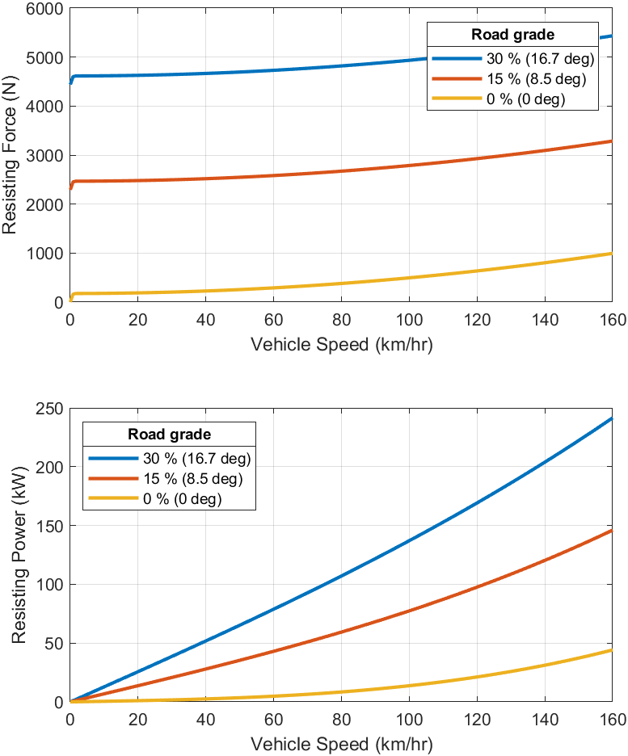
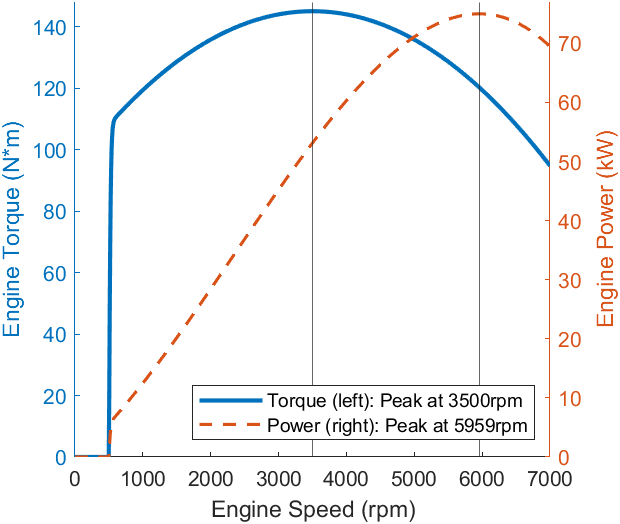

# Power-Split HEV Model

Parameters

- [PowerSplitHEV_params.m](PowerSplitHEV_params.m)

## Vehicle

Vehicle longitudinal resisting force and power.

## Engine

Torque and power curves at wide open throttle.

*Copyright 2022 The MathWorks, Inc.*
