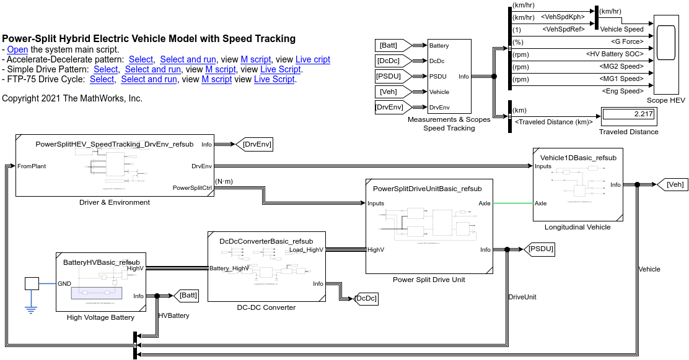
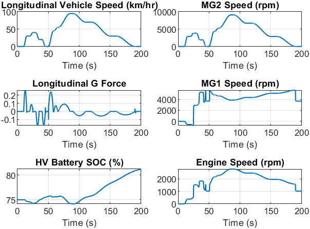

# Hybrid Electric Vehicle Model in Simscape&trade;

Version 1.1

Copyright 2021 The MathWorks, Inc.

https://www.mathworks.com/

## Introduction

This example includes a Hybrid Electric Vehicle model
in Simscape&trade;,
demonstrating some new features of the recent releases
of MATLAB&reg;
and featuring Subsystem Reference which enables
modular physical modeling workflow.

The model includes
an abstract Power-Split Hybrid Electric Vehicle (HEV) model
with a simple rule-based controller
for speed tracking simulation.
It can be used to better understand
how to work with [Subsystem Reference][url_subref]
for an automotive application.
For a vehicle model that includes
more detailed supervisory and engine controllers,
please see the reference applications in
[Powertrain Blockset&trade;][url_ptbsref].

[url_subref]:https://www.mathworks.com/help/simulink/ug/referenced-subsystem-1.html

[url_ptbsref]:https://www.mathworks.com/help/autoblks/powertrain-reference-applications.html

The included abstract model is suitable
for the system level simulation of
longitudinal vehicle behavior
as it runs faster than real time.
The model consists of components such as motor, engine,
power-split device, and so on,
and they are built in a modular manner using
Subsystem Reference and Simscape product family
demonstrating a workflow where
physical components are built and tested individually
and also they can be easily integrated into
a complete vehicle system model.

The HEV model and its components are managed in
a MATLAB project and
some components come with their own test setups.

## Tool Requirements

Supported MATLAB version: R2021a or newer releases

Required:
[MATLAB](https://www.mathworks.com/products/matlab.html),
[Simulink&reg;](https://www.mathworks.com/products/simulink.html),
[Stateflow&reg;](https://www.mathworks.com/products/stateflow.html),
[Powertrain Blockset](https://www.mathworks.com/products/powertrain.html),
[Simscape](https://www.mathworks.com/products/simscape.html),
[Simscape Driveline&trade;](https://www.mathworks.com/products/simscape-driveline.html),
[Simscape Electrical&trade;](https://www.mathworks.com/products/simscape-electrical.html)

Optional:
[Parallel Computing Toolbox&trade;](https://www.mathworks.com/products/parallel-computing.html)

## What's New in Version 1.1

### Highlights

Parameter Sweep Workflow in Live Script

- Demonstrates how to investigate the effect of reduction gear ratio,
  high-voltage battery capacity and high-voltage battery weight
  on the electrical efficiency.
  You can optionally use Parallel Computing Toolbox to shorten
  total simulation time.
- Watch [YouTube video](https://www.youtube.com/watch?v=cbo83A8K_4w)
  showing the workflow as well as real-time application.
  - Real-Time application presented in the video will be added
    to this project in future updates.

### Other Updates

- MATLAB R2021a or newer release is required.

## How to Use

Open `HybridElectricVehicle.prj` in MATLAB, and
it will automatically open the Live Script `HEV_main_script.mlx`.
The script contains the description of the model and
hyperlinks to models and scripts.

## How to Use in MATLAB Online

You can try this in [MATLAB Online][url_online].
In MATLAB Online, from the **HOME** tab in the toolstrip,
select **Add-Ons** &rarr; **Get Add-Ons**
to open the Add-On Explorer.
Then search for the submission name,
navigate to the submission page,
click **Add** button, and select **Save to MATLAB Drive**.

[url_online]:https://www.mathworks.com/products/matlab-online.html

## License

See [`LICENSE.txt`](LICENSE.txt).
